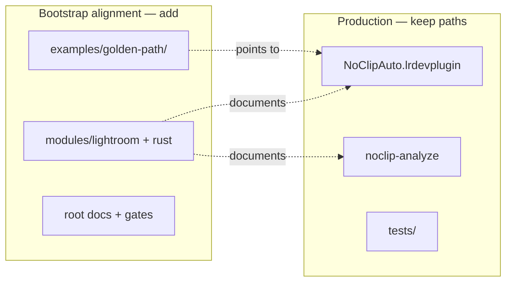

# BUILD_PLAN — NoClip Auto

Active sprint tasks only. Completed items archive to [docs/BUILD_PLAN_COMPLETED.md](docs/BUILD_PLAN_COMPLETED.md) and [COMPLETED_TASKS.md](COMPLETED_TASKS.md) via `scripts/archive-completed-tasks.ps1`.

**Current sprint:** Audit — post-TM ship readiness (2026-06-18). TM migration complete locally; **push pending**.

**Labels:** `[AGENT]` scriptable · `[LR]` needs Lightroom via automation · `[HUMAN]` human developer (template uses `[HUMAN]`; legacy `[HUMAN-ONLY]` = H1–H3) · `[AUTO]` CI/scripts · `[PARALLEL-OK]` safe to parallelize

**Agent rule:** Execute **Sequential** lane first. After each `[AGENT]` step run `scripts/watch-agent-gates.ps1 -Once -Step <label>`. Document major decisions in `DECISION_LOG.md`.

---

## Sprint Audit — Ship readiness (2026-06-18)

Source: `/audit` — see local `CODE_REVIEW.md` (gitignored).

| ID | Task | Owner | Gate |
|----|------|-------|------|
| **Audit.1** | ⬜ Commit + push TM/bootstrap migration (~70 files); run `check-github-ci.ps1 -WaitSeconds 300` | [HUMAN] | Remote CI + Security Scan + CodeQL green |
| **Audit.2** | ✅ Refresh stale assessment docs (BUILD_PLAN, START_HERE) | [AGENT] | `validate-bootstrap.ps1 -Quick` |
| **Audit.3** | ⬜ Visual README review on GitHub homepage (TM.H2) | [HUMAN] | — |

---

## Assessment — Repository vs Bootstrap Template (2026-06-18)

**Upstream template:** [edwardlthompson/agent-project-bootstrap](https://github.com/edwardlthompson/agent-project-bootstrap) @ v0.11.0  
**Active stack:** `lightroom` + `rust` (production paths — not `examples/` stubs)  
**Product status:** v1.3.7 shipped (M0–M9 complete); development paused (alpha)

### Production layout (preserve — do not relocate)

| Component | Path | Role |
|-----------|------|------|
| Lightroom plugin | `NoClipAuto.lrdevplugin/` | Shipped `.lrdevplugin` — install path locked |
| Rust analyzer | `noclip-analyze/` | Bundled into `bin/{win-x64,macos-arm64}/` |
| Tests & fixtures | `tests/` | Golden JSON, bench JPEG, tone-quality inputs |
| LR automation | `scripts/smoke/`, `scripts/*-lr-*.ps1` | M0–M9 milestone gates |

### Bootstrap alignment — complete (2026-06-18)

| Bootstrap expectation | NoClip equivalent | Status |
|----------------------|-------------------|--------|
| Labeled BUILD_PLAN | `BUILD_PLAN.md` + `[AGENT]`/`[HUMAN]` labels | ✅ |
| AGENT_MEMORY, AGENTS, CHANGELOG (root) | Root docs + `docs/` stubs | ✅ |
| COMPLETED_TASKS + archive | `COMPLETED_TASKS.md` + `docs/BUILD_PLAN_COMPLETED.md` | ✅ |
| CI + security + CodeQL | Extended `ci.yml`, `security.yml`, `codeql.yml` | ✅ (local; push pending) |
| Gates + slash commands | 25 `.cursor/commands/`, `check-batch-commands.ps1` | ✅ |
| Modules + Golden Path | `modules/`, `examples/golden-path/` | ✅ |
| Repo hygiene + template provenance | `.editorconfig`, `.template-version`, pre-commit | ✅ |
| Security ops docs | `SECURITY_TRIAGE`, `THREAT_MODEL`, `PRIVACY`, `RUNBOOK` | ✅ |

### Gaps — resolved (2026-06-18)

All sequential TM tasks complete. Bootstrap parity ~100% for **lightroom+rust** child profile. Archive: [COMPLETED_TASKS.md](COMPLETED_TASKS.md), [docs/BUILD_PLAN_COMPLETED.md](docs/BUILD_PLAN_COMPLETED.md).

### Gate evidence (host, 2026-06-18)

| Gate | Command | Status |
|------|---------|--------|
| M0 smoke | `scripts/smoke/m0_smoke.ps1` | Not re-run this session |
| M2 + Rust | `cargo test` + `m2_smoke.ps1` | Not re-run this session |
| FOSS | `foss-audit.ps1` | Not re-run this session |
| Bootstrap | `validate-bootstrap.ps1 -Quick` | **PASS 2026-06-18** (/audit) |
| Feature gate CI | `feature-gate.ps1 -Stack lightroom-rust -Ci` | **PASS 2026-06-18** (/audit) |
| Bootstrap full | `validate-bootstrap.ps1` | **PASS 2026-06-18** (TM.6) |
| Feature gate full | `feature-gate.ps1 -Stack lightroom-rust` | **PASS 2026-06-18** (TM.7) |
| TM.8 smokes | `m0_smoke.ps1` + `m2_smoke.ps1` | **PASS 2026-06-18** (TM.8) |
| TM gate | `run-milestone-tm-gate.ps1` | **PASS 2026-06-18** (TM.9) |

---

## Sprint TM — Template Migration

**Objective:** Full bootstrap template parity for a **lightroom+rust** child repo without moving production plugin/analyzer paths or breaking M0–M9 gates.

**Gate after each `[AGENT]` phase:** `scripts/watch-agent-gates.ps1 -Once -Step <tmN>` (see [Gates](#validation-matrix)).

### Sequential lane — archived ✅

All TM.0–TM.9 tasks complete. See [COMPLETED_TASKS.md](COMPLETED_TASKS.md).

| ID | Task | Owner | Gate |
|----|------|-------|------|
| **TM.9** | ✅ `scripts/run-milestone-tm-gate.ps1` — validate-bootstrap + feature-gate + M9 regression; archive TM sprint | [AGENT] | TM gate **PASS 2026-06-18** |

### Parallel lane — archived ✅

| ID | Task | Owner | Status |
|----|------|-------|--------|
| **TM.P1** | ✅ Security ops docs: `SECURITY_TRIAGE`, `THREAT_MODEL`, `PRIVACY`, `RUNBOOK` | [AGENT] | Done 2026-06-18 |
| **TM.P2** | ✅ `docs/help/BATCH_COMMANDS.md` + full `.cursor/commands/` (25 slash commands) + `batch-commands.mdc` | [AGENT] | Done 2026-06-18 |
| **TM.P3** | ✅ `check-github-ci.ps1/.sh`, `setup-github-repo.ps1/.sh` | [AGENT] | Done 2026-06-18 |

### Human lane

| ID | Task | Owner | Status |
|----|------|-------|--------|
| **TM.H1** | Run `setup-github-repo.ps1` for Dependabot + branch protection | [HUMAN] | ✅ Done 2026-06-18 |
| **TM.H2** | Visual README review on GitHub after push | [HUMAN] | **Pending** — open repo homepage after merge |
| **TM.H3** | Approve `docs/adr/0001-core-architecture.md` | [HUMAN] | ✅ Approved 2026-06-18 |

---

## Validation matrix

| Phase | Host gates | LR gates |
|-------|------------|----------|
| TM.0–TM.2 | `validate-bootstrap.ps1 -Quick` | — |
| TM.3–TM.4 | `validate-bootstrap.ps1` + `m0_smoke.ps1` | — |
| TM.5–TM.6 | `validate-bootstrap.ps1` + `foss-audit.ps1` | — |
| TM.7 | `feature-gate.ps1 -Stack lightroom-rust` | — |
| TM.8 | `m0_smoke.ps1` + `m2_smoke.ps1` + `run-milestone-gate.ps1 -Milestone 2` | Optional `m1_smoke.ps1` |
| TM.9 closure | `run-milestone-tm-gate.ps1` | Optional `m5_menu_smoke.ps1` |

### watch-agent-gates step map

| `-Step` | Delegates to |
|---------|----------------|
| `tm0` | `validate-bootstrap.ps1 -Quick` |
| `tm6` | `validate-bootstrap.ps1` + `check-repo-hygiene.ps1` |
| `tm4` | `validate-bootstrap.ps1` + `m0_smoke.ps1` |
| `tm7` | `feature-gate.ps1 -Stack lightroom-rust` (full) |
| `tm8` | `m0_smoke.ps1` + `m2_smoke.ps1` |
| `tm9` | `run-milestone-tm-gate.ps1` |
| `scaffold` | `validate-bootstrap.ps1 -Quick` |
| `tests` | `m2_smoke.ps1` + `cargo test` |
| `wire` | `run-milestone-gate.ps1 -Milestone 2` |

---

## Explicit non-goals

- Moving `NoClipAuto.lrdevplugin/` into `examples/lightroom/` (breaks install, releases, smoke paths)
- Moving `noclip-analyze/` into `examples/rust/` (breaks `Cargo.toml` workspace and CI `working-directory`)
- Replacing PowerShell milestone gates with bash as primary path on Windows
- Resuming product development or fixing alpha reliability bugs (out of scope for TM)
- Changing Apache-2.0 license to MIT (template default — keep project license)
- Adding web/python/android example stacks

---

## Risk mitigation

1. **One TM phase per commit** with green `validate-bootstrap -Quick` before the next.
2. **No parallel agents** on `NoClipAuto.lrdevplugin/Core/Pipeline/`, `noclip-analyze/src/`, or `scripts/run-milestone-gate.ps1`.
3. **Link-update pass** in TM.5 — grep for `docs/BUILD_PLAN.md`, `docs/AGENT_MEMORY.md`, `.cursor/AGENTS.md` after root relocation.
4. **CI additive only** in TM.4 — existing `rust-test`, `m0-smoke`, `m2-smoke`, `size-gate`, `bench-gate` jobs must stay green.
5. If TM.4 breaks CI, revert workflow commit before proceeding.

---

## Reference docs (not active TM tasks)

- Algorithm: [docs/ALGORITHM.md](docs/ALGORITHM.md)
- LR testing: [docs/LR_TESTING.md](docs/LR_TESTING.md)
- Mac: [docs/MAC.md](docs/MAC.md)
- GitHub metadata: [docs/GITHUB_ABOUT.md](docs/GITHUB_ABOUT.md)
- Completed milestones M0–M9: [docs/BUILD_PLAN_COMPLETED.md](docs/BUILD_PLAN_COMPLETED.md)
- Legacy gates: [docs/GATES.md](docs/GATES.md)

## Archived sprints

| Sprint | Status | Archive |
|--------|--------|---------|
| M0–M9 — Product milestones | Complete | [docs/BUILD_PLAN_COMPLETED.md](docs/BUILD_PLAN_COMPLETED.md) |
| TM — Template Migration | **Complete** | [COMPLETED_TASKS.md](COMPLETED_TASKS.md) |
